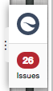
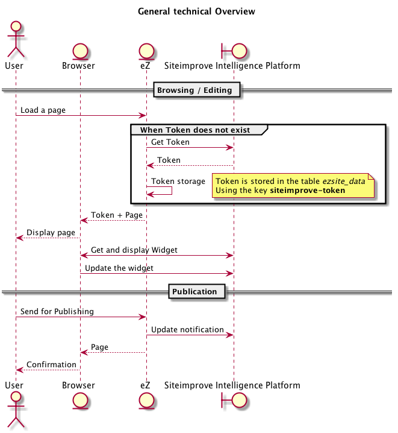
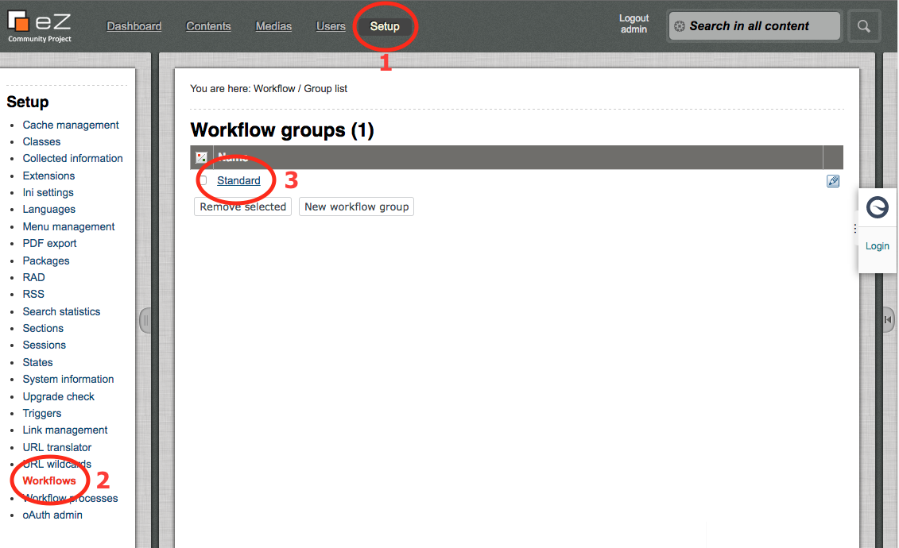
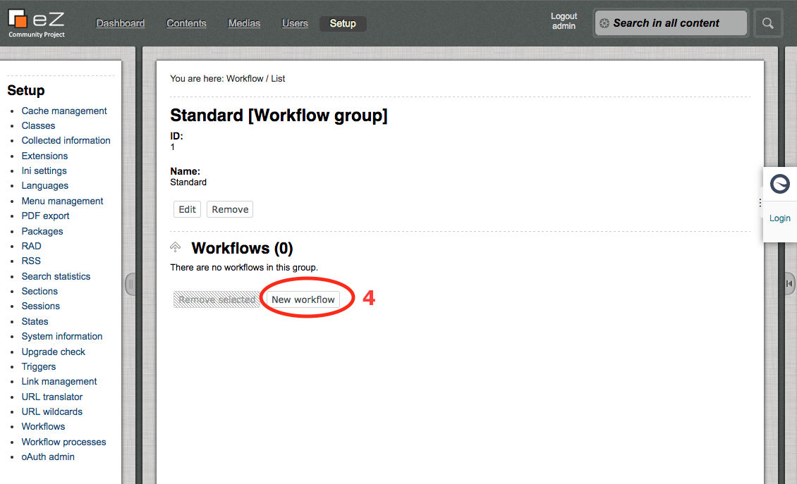
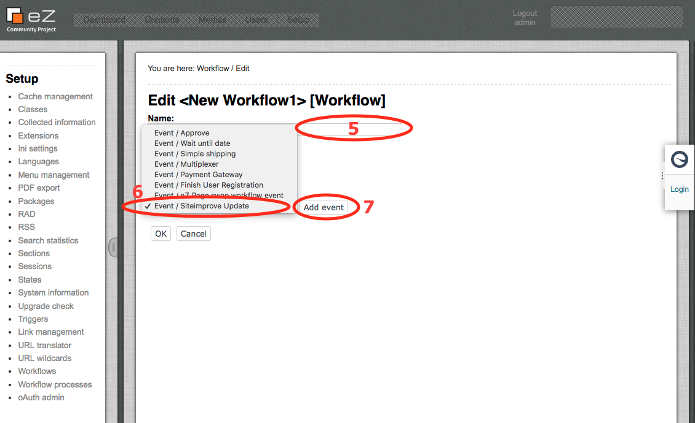
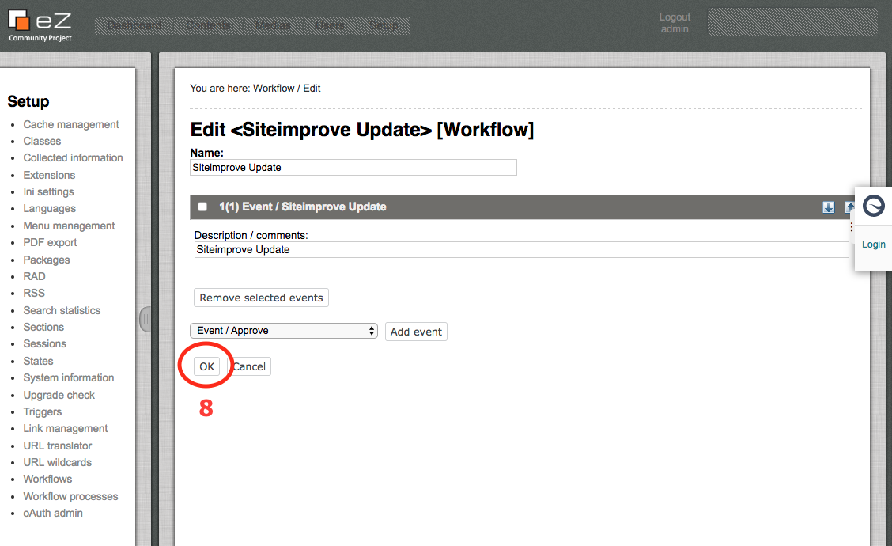
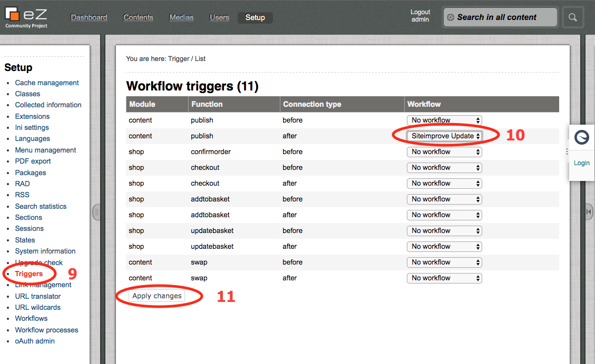

# Siteimprove eZ Platform Bundle

The new Siteimprove plugin bridges the gap between the eZ Platform and the Siteimprove Intelligence Platform. Thanks to
 the seamless integration, you are now able to put your Siteimprove results to use where they are most valuable – 
 during your content creation andediting process.

With analytics and content insights always at hand, contributors can test, fix, and optimize their work continuously. 
Once the detected issues have been assessed, you can directly re-recheck the relevant page when it is published and see 
if further actions are needed. Delivering a superior digital experience has never been more efficient and convenient.

## Installation instructions

### Requirements

* eZ Publish 5.4+ / eZ Publish Community Project 2014.07+
* PHP 5.6+

### Use Composer

Using composer you can run this command line to install the bundle:

```bash
$ composer require siteimprove/cms-plugin-ezplatform
```

### Register the bundle

Activate the bundle in `(ezpublish|app)\(EzPublish|app)Kernel.php` file.

```php
// (ezpublish|app)\(EzPublish|app)Kernel.php

public function registerBundles()
{
   ...
   $bundles = array(
       new FrameworkBundle(),
       ...
       new Siteimprove\Bundle\SiteimproveBundle\SiteimproveBundle(),
   );
   ...
}
```
### Add the routes

```yml
# (ezpublish|app)/config/routing.yml

_siteimprove_routes:
    resource: "@SiteimproveBundle/Controller"
    type:     annotation
    prefix:   /_siteimprove
    
```


### Optionnal

This bundle does server-to-server call to the Siteimprove Intelligence Platform, if for an reason your server is behind 
a HTTP Proxy you can set up the credentials in your config.yml

```yml
# (ezpublish|app)/config/config.yml

siteimprove:
    proxy_settings:
        host: proxy.net
        port: 8080
        user: user
        pass: password
```

## How it works

### Overview

Siteimprove Intelligence Platform is in charge to check the pages that you are browsing and/or editing.
To do that, the plugin adds a Javascript tag that will communicate (client-side) with Siteimprove Intelligence Platform.
 
You will need credentials to "Sign-in" inside the little widget, that will appear on the right of the screen. 


> You can decide where to display it in your Siteimprove profile.

A server-to-server call is made after publication to warn Siteimprove Intelligence Platform that pages have changed.


### Technically

Here a basic diagram that shows the flow.



## eZ Publish Legacy Specificities

#### Install the Legacy extension

```bash
php (ezpublish|app)/console ezpublish:legacybundles:install_extensions
cd ezpublish_legacy
php bin/php/ezpgenerateautoloads.php -e
```


#### Configure a workflow

In order to let Siteimprove Intelligence Platform knows that a content has been updated you need to setup a workflow.
To do that you need to go in your Administraton Interface.






Then you need to trigger this workflow.


> If you have already a workflow set, you need to create a [Multiplexer](https://doc.ez.no/eZ-Publish/Technical-manual/4.x/Reference/Workflow-events/Multiplexer).


## License

[License](LICENSE)
